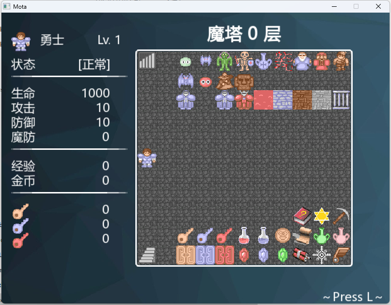

# 简介



基于C++和SFML制作的魔塔框架。

- [Docs / 使用文档](https://mota-cpp-tutorial.readthedocs.io/zh-cn/latest/)
- [Open Source / 动画编辑器开源](https://github.com/JasonLeon01/MotaAnimationDesigner)
- [Open Source / RM动画分离器开源](https://github.com/JasonLeon01/MotaAnimationSeparator)
- [Open Source / 怪物设计器开源](https://github.com/JasonLeon01/MotaEnemyDesigner)
- [Open Source / 地图编辑器开源](https://github.com/JasonLeon01/MotaMapDesigner)
- [Open Source / NPC设计器开源](https://github.com/JasonLeon01/MotaNPCDesigner)

# 目录结构

```bash
├── /data/                    # 数据文件
│ ├─ /actor/                  # 角色信息的数据
│ ├─ /animation/              # 动画信息的数据
│ ├─ /element/                # 属性信息的数据
│ ├─ /enemy/                  # 敌人信息的数据
│ ├─ /item/                   # 物品信息的数据
│ ├─ /map/                    # 地图信息的数据
│ └─ /npc/                    # NPC信息的数据
├── /font/                    # 使用到的字体文件
├── /graphics/                # 使用到的图片素材文件
├── /ico/                     # exe文件icon相关
├── /include/                 # 包含的头文件
│ ├─ /SFML/                   # SFML库相关的头文件
│ └─ /Game/                   # 游戏框架相关的头文件
│ └─ ├─ /stdafx.h/            # 大多数头文件和外部函数的存放
│    ├─ /GameSystem.h/        # 游戏系统的设置
│    ├─ /GameData.h/          # 游戏数据的设置
├── /lib/                     # 第三方库目录
├── /ref/                     # 游戏的参考文件
│ ├─ /config.ini/             # 游戏设置相关配置
│ ├─ /main.ini/               # 游戏初始化配置
│ ├─ /motaName.ini/           # 魔塔名对应初始化
│ ├─ /ShortcutKey.txt/        # 快捷键的描述文本
├── /sound/                   # 使用到的音乐素材文件
├── /src/                     # 源文件的存放
│ ├─ /stdafx.cpp/             # stdafx源文件
│ ├─ /GameSystem.cpp/         # GameSystem源文件
│ ├─ /GameData.cpp/           # GameData源文件
│ ├─ /main.cpp/               # 主源文件
├── /tools/                   # 常用小工具
│ ├─ /AnimationDesigner.exe/  # 游戏动画设计器
│ ├─ /AnimationSeparator.exe/ # RM格式动画转换器
│ ├─ /EnemyDesigner.exe/      # 游戏怪物设计器
│ ├─ /MapDesigner.exe/        # 游戏地图设计器
│ ├─ /NPCDesigner.exe/        # 游戏NPC对话设计器
├── /CMakeLists.txt/          # CMake相关
├── /config.exe/              # 游戏设置可执行文件
├── /main.exe/                # 启动游戏的可执行文件
```
