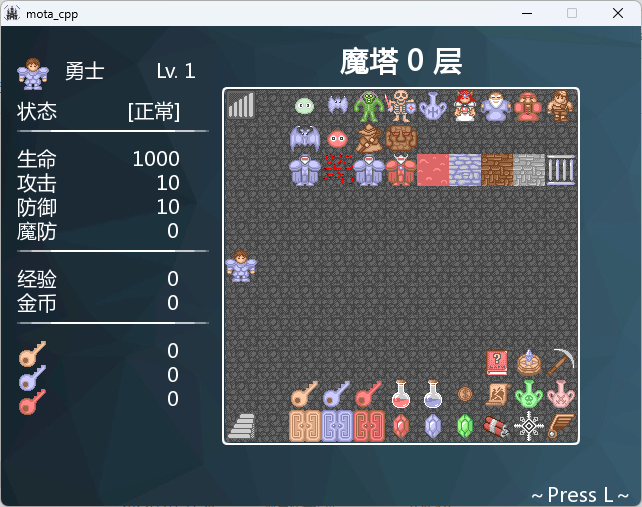

# mota_cpp_framework

## 简介



基于C++和SFML制作的魔塔框架。

- [Docs / 使用文档](https://mota-cpp-tutorial.readthedocs.io/zh-cn/latest/)
- [Open Source / 动画编辑器开源](https://github.com/JasonLeon01/MotaAnimationDesigner)
- [Open Source / RM动画分离器开源](https://github.com/JasonLeon01/MotaAnimationSeparator)
- [Open Source / 怪物设计器开源](https://github.com/JasonLeon01/MotaEnemyDesigner)
- [Open Source / 地图编辑器开源](https://github.com/JasonLeon01/MotaMapDesigner)
- [Open Source / 物品编辑器开源](https://github.com/JasonLeon01/ItemDesigner)
- [Open Source / NPC设计器开源](https://github.com/JasonLeon01/MotaNPCDesigner)
- [Open Source / 打包工具开源](https://github.com/JasonLeon01/MotaPackager)

> 运行各种工具和config.exe需要下载.net 6.0 runtime（大约56MB），在双击打开exe后会弹窗提示，按照指示下载即可。

## 目录结构

```bash
├── /data/                      # 数据文件
│ ├─ /actor/                    # 角色信息的数据
│ ├─ /animation/                # 动画信息的数据
│ ├─ /element/                  # 属性信息的数据
│ ├─ /enemy/                    # 敌人信息的数据
│ ├─ /item/                     # 物品信息的数据
│ ├─ /map/                      # 地图信息的数据
│ └─ /npc/                      # NPC信息的数据
├── /assets/                    # 使用到的资源素材文件
│ ├─ /animation/                # 动画素材
│ ├─ /character/                # 行走图素材
│ ├─ /picture/                  # 图片素材
│ ├─ /system/                   # 系统素材
│ ├─ /bgm/                      # 背景音乐素材
│ ├─ /se/                       # 音效素材
│ ├─ /voice/                    # 语音素材
│ ├─ /ico/                      # exe图标素材
│ └─ /font/                     # 使用到的字体文件
├── /include/                   # 包含的头文件
│ ├─ /SFML/                     # SFML库相关的头文件
│ ├─ /Game/                     # 游戏框架相关的头文件
│ │ ├─ /stdafx.hpp/             # 大多数头文件和外部函数的存放
│ │ ├─ /System/                 # 游戏系统的设置
│ │ ├─ /Data/                   # 游戏数据的设置
│ ├─ /Screen/                   # 游戏屏幕上显示的内容，包括各种窗口和场景
│ └─ /nlohmann/                 # nlohmann库，主要使用其JSON文件解析
├── /lib/                       # 第三方库目录
├── /ref/                       # 游戏的参考文件
├── /sound/                     # 使用到的音乐素材文件
├── /src/                       # 源文件的存放
├── /tools/                     # 常用小工具
├── /CMakeLists.txt/            # CMake相关
├── /config.exe/                # 游戏设置可执行文件
└── /main.exe/                  # 启动游戏的可执行文件
```

## 更新说明

### 2024.3.9 Version 3.0

- [x] 更换更加清晰的素材，让素材平滑放大
- [x] 在未能成功读取文件时增加弹窗提示
- [x] 大幅改进地图编辑器功能，可以直接点击事件名右侧的...按钮进行更直观的可视化编辑
- [x] 增加播放动画的操作
- [x] 将事件名DSL修改为更符合函数特征的格式
- [x] 将所有资源文件整合至assets文件夹中
- [x] 增加语音功能
- [x] 增加鼠标操作
- [x] 增加自动寻路功能
- [x] 增加更多的替代，将变量改为[vx]，增加物品数量[ix]

### 2023.12.16 Version 2.2

- [x] 增加picon和picoff指令
- [x] 将main.cpp中的窗口再次拆分至各文件，减少单个文件复杂度，增加代码可读性
- [x] 改进了NPC编辑器的UI
- [x] 在分享的网盘中删除了历史版本，不再支持下载

### 2023.12.7 Version 2.1

- [x] 更换更加清晰的素材，让素材平滑放大
- [x] 在未能成功读取文件时增加弹窗提示

### 2023.11.29 Version 2.0

* [x] 增加物品编辑器
* [x] 将所有数据文件都改成json格式，增加可读性
* [x] 大幅优化代码，减少重复冗余
* [x] 将SFML的-s-d部分也添加到lib中，方便用户进行Debug
* [x] 游戏内添加设置分区，可以调整分辨率和音量等
* [x] 将游戏窗口名外置，在main.ini中修改
- [x] 键盘的repeat添加了首回延迟
- [x] 取消箭头素材，采用RMXP窗口自带的箭头
- [x] 将存读档按键改为“[”和“]”
- [x] 大幅优化架构，将原先文件里面的类尽量拆开到各文件
- [x] 增添自动事件，将出现触发条件设为3即可

# 联系我们

本框架主要由[Jason Leon](https://github.com/JasonLeon01)（魔塔圈内ID `PRE`）制作编写

交流QQ群号：117445471（小号魔塔群）、210766281（大傻官方交流群）、662891318（盐铁桶子の魔塔小屋）

如有相关意见、建议或者合作意向，可发送邮件至[jasonleon01@outlook.com](mailto:jasonleon01@outlook.com)联系我。

# 合作者

[@Jason Leon](https://github.com/JasonLeon01)：PRE，b站空间[@Jason Leon](https://space.bilibili.com/439537579/)，本框架主要编写者，核心代码和主要地图绘制。

[@Youwei Zhao](https://github.com/zhaouv)：推动了各类编辑器的改动，使得更加对用户友好。

@忆忆：b站空间[@卡路十里](https://space.bilibili.com/200729395)，帮助找出bug、添加必要功能等。

# 版权声明

Copyright © 2024-2040 Metempsychosis Game Studio. All rights reserved.
